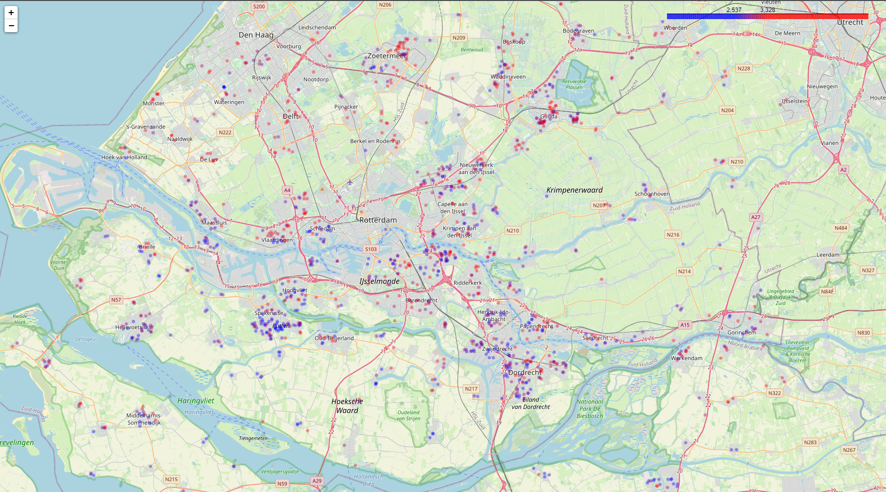

# Funda Scrap
Data scrapper for dutch housing website [Funda.NL](http://funda.nl/)
Written in Python using [Scrapy](https://scrapy.org/) library

## FundaSpider
**FundaSpider** crawls `http://funda.nl/en/koop/` (possible to set search criteria) webpage for the following infomration:
- address
- price
- floor area
- property area
- number of rooms
- id
- city
- latitude
- longtitude

## SaveToFilePipeline
**SaveToFilePipeline** exports data to CSV file
- Doesn't save items that already exist in the database.
- Cleans up item's *address* postal code formatting
- Reads georgaphical position from web API

## Price map
Displays properties map color-labeled by price per square meter

